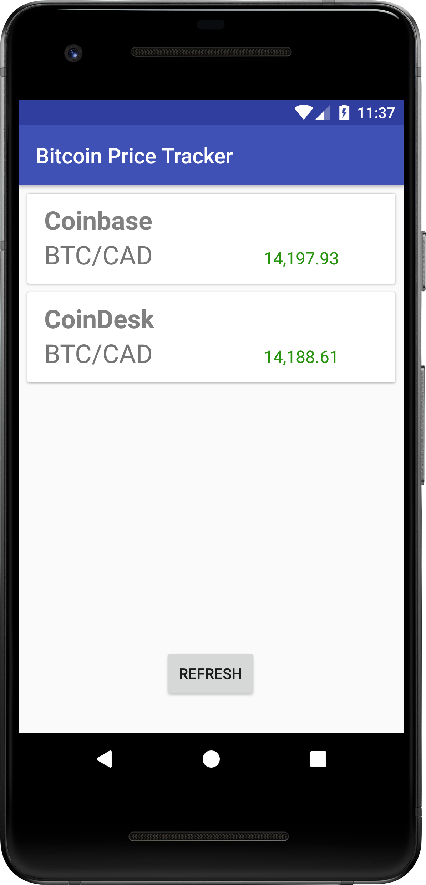

# Bitcoin Price Tracker

This is a very basic Android app written in Java that retrieves the current Bitcoin price (in CAD) from Coinbase and CoinDesk. The app supports Android 7+.

  

## Download Latest Release

You can download a copy of the latest apk on the [releases](https://github.com/seanvm/BitcoinPriceTracker/releases) page of this repo.

